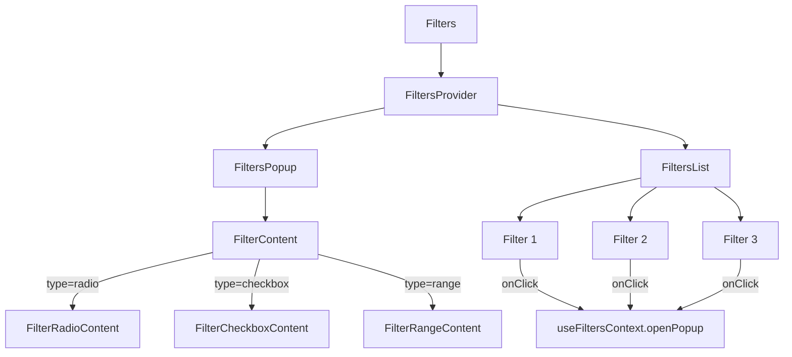
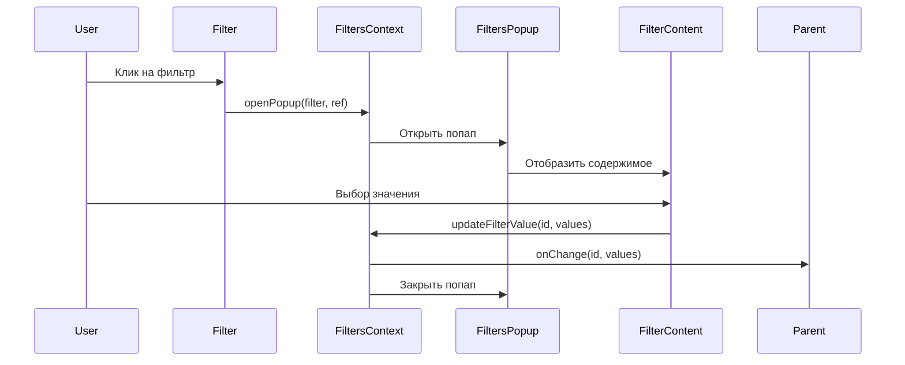

# Архитектура общей шторки фильтров

## Обзор

Данный проект представляет собой архитектурное решение для создания общей шторки фильтров в компоненте Filters. Вместо того, чтобы каждый тип фильтра (radio, checkbox, range и т.д.) имел свой собственный попап, мы создаем единую шторку, которая будет использоваться всеми типами фильтров.

## Содержание

1. [Архитектурный план](#архитектурный-план)
2. [Диаграммы архитектуры](#диаграммы-архитектуры)
3. [Руководство по реализации](#руководство-по-реализации)
4. [Руководство по миграции](#руководство-по-миграции)
5. [Руководство по тестированию](#руководство-по-тестированию)
6. [Примеры использования](#примеры-использования)

## Архитектурный план

Подробный архитектурный план можно найти в файле [filters-architecture-plan.md](../../filters-architecture-plan.md).

Основные компоненты архитектуры:

1. **FiltersContext** - контекст React для управления состоянием фильтров и попапа
2. **FilterContent** - компонент для отображения содержимого попапа в зависимости от типа фильтра
3. **Компоненты содержимого** - специализированные компоненты для каждого типа фильтра (FilterRadioContent, FilterCheckboxContent, FilterRangeContent)
4. **Обновленный Filters** - компонент, который использует FiltersProvider для управления состоянием
5. **Обновленные Filter_type_*** - компоненты, которые используют контекст вместо собственных попапов

## Диаграммы архитектуры

Подробные диаграммы архитектуры можно найти в файле [architecture-diagrams.md](./architecture-diagrams.md).

### Общая архитектура

### Поток данных

## Руководство по реализации

Подробное руководство по реализации можно найти в файле [implementation-guide.md](./implementation-guide.md).

Основные шаги реализации:

1. Создание контекста фильтров (FiltersContext)
2. Создание компонента содержимого (FilterContent)
3. Создание компонентов содержимого для разных типов фильтров
4. Обновление компонента Filters
5. Обновление компонентов Filter_type_*

## Руководство по миграции

Подробное руководство по миграции можно найти в файле [migration-guide.md](./migration-guide.md).

Основные шаги миграции:

1. Создание новых файлов (FiltersContext, FilterContent и т.д.)
2. Обновление существующих компонентов (Filters, Filter_type_* и т.д.)
3. Тестирование новой архитектуры
4. Обеспечение обратной совместимости (при необходимости)

## Руководство по тестированию

Подробное руководство по тестированию можно найти в файле [testing-guide.md](./testing-guide.md).

Основные аспекты тестирования:

1. Модульное тестирование отдельных компонентов
2. Интеграционное тестирование взаимодействия компонентов
3. Функциональное тестирование полного цикла работы фильтров

## Примеры использования

Подробные примеры использования можно найти в файле [usage-examples.md](./usage-examples.md).

Примеры включают:

1. Базовое использование
2. Использование с загрузкой данных
3. Использование с кастомными стилями
4. Использование с разными типами фильтров
5. Использование с обработкой изменений
6. Использование с сохранением состояния в URL

## Преимущества архитектуры

1. **Централизованное управление состоянием** - Все состояние фильтров и логика управления попапом находятся в одном месте (FiltersContext).

2. **Избегание передачи пропсов через несколько уровней** - Компоненты могут получать доступ к состоянию и методам через контекст.

3. **Чистое разделение ответственности** - Каждый компонент отвечает за свою часть функциональности:
   - Filters - отображение списка фильтров
   - FiltersContext - управление состоянием
   - FilterContent - отображение содержимого попапа
   - Filter_type_* - отображение кнопок фильтров

4. **Легкое расширение** - Добавление новых типов фильтров требует только создания нового компонента содержимого и добавления его в FilterContent.

## Потенциальные проблемы и их решения

1. **Обратная совместимость** - Изменение API может потребовать обновления кода, использующего эти компоненты. Можно создать обертки для обеспечения обратной совместимости или документировать изменения для миграции.

2. **Производительность** - Использование контекста может привести к перерендерингу компонентов при изменении состояния. Можно оптимизировать с помощью мемоизации и разделения контекста на более мелкие части.

3. **Тестирование** - Компоненты, использующие контекст, могут быть сложнее тестировать. Можно создать вспомогательные функции для тестирования или использовать моки для контекста.

## Заключение

Новая архитектура общей шторки фильтров обеспечивает более чистое разделение ответственности, централизованное управление состоянием и легкое расширение. Она позволяет избежать дублирования кода и упрощает поддержку и расширение функциональности в будущем.

Использование React Context обеспечивает удобный доступ к состоянию и методам из любого компонента, что упрощает разработку и тестирование.
